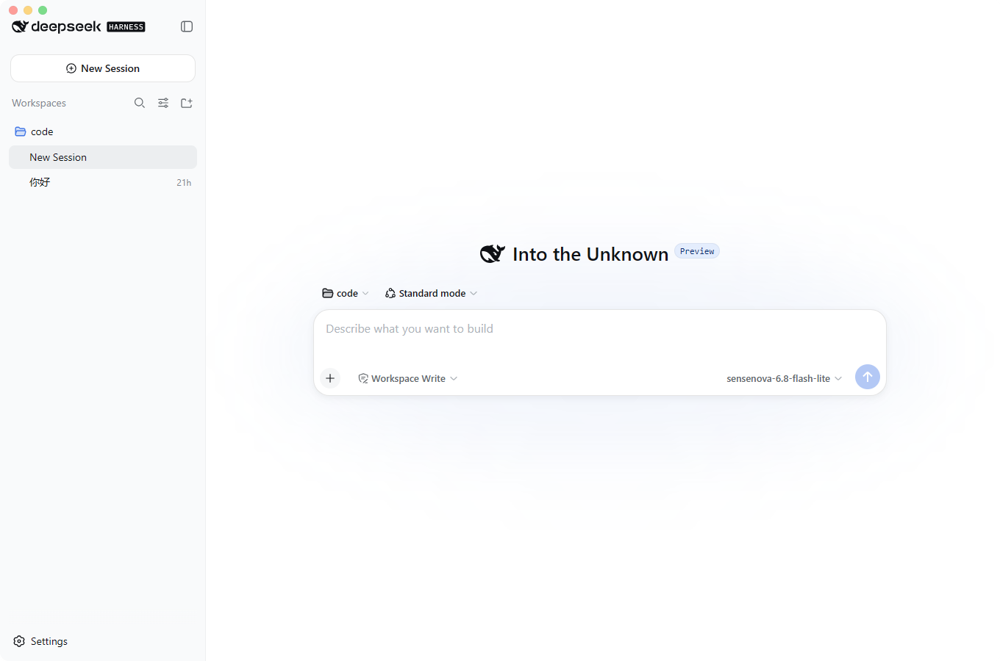

<div align="center">

# dsh desktop

A cross-platform Tauri desktop client for DeepSeek Harness (`dsh web`)

**[Official Website · Download](https://dsh-desktop.cc.cd/en/)** · **English** · [简体中文](README.md)

<br/>

[](https://dsh-desktop.cc.cd/en/)
[](https://github.com/MochiNek0/dsh-desktop/releases)
[](https://tauri.app/)

[](LICENSE)

<br/>
<br/>



</div>

<br/>

> **Disclaimer**: This is a third-party desktop client for [DeepSeek Harness](https://github.com/deepseek-ai/deepseek-harness). It is not affiliated with, sponsored, or endorsed by DeepSeek.

---

## Overview

**dsh desktop** (the DeepSeek Harness desktop app) automatically starts the local `dsh web` service in the background and embeds it into a native window upon launch. There is no need to manually manage terminal sessions or port allocations. Sessions, credentials, and configurations are shared seamlessly with the CLI (`$DSH_HOME`, default `~/.dsh`).

## Features

- **Out of the Box**: Automatically detects and sets up Node.js and the `dsh` runtime without requiring administrator privileges.
- **Port Conflict-Free**: Starts on an auto-assigned loopback port, coexisting seamlessly with manual `dsh web` instances.
- **Native Experience**: Modern frameless UI featuring theme synchronization, a bilingual interface, native system notifications, and auto-start support.
- **Shared Environment**: Shares the same global `dsh` CLI environment, with startup checks and one-click upgrades.
- **Plugin Management**: Built-in visual panel to install and remove dsh plugins effortlessly. Alternatively, use the integrated terminal pre-configured with the correct `PATH`.
- **Clean Lifecycle**: Single-instance enforcement with complete child process cleanup upon exit. Automatically offers a restart if `dsh web` crashes unexpectedly.

## Installation

> **Important**: It is recommended to install **v0.1.3 and later versions**, as previous versions may have some known issues. Currently, the application has been verified on **Windows** and **Linux (Debian-based systems)**.

Download the latest release package for your operating system from the **[official website dsh-desktop.cc.cd](https://dsh-desktop.cc.cd/en/)** or the [GitHub Releases page](https://github.com/MochiNek0/dsh-desktop/releases):

| Operating System | Package Format | Details |
| :--- | :--- | :--- |
| **Windows** | `.exe` installer | Requires WebView2 (automatically prompted/downloaded if missing) **[Verified]** |
| **macOS** | `.dmg` image | Universal binary supporting both Apple Silicon and Intel **[Unverified, feedback welcome]** |
| **Linux** | `.AppImage` / `.deb` | `.AppImage` is recommended for built-in self-updater support **[Verified on Debian]** |

> **macOS First-Launch Note**
>
> If blocked by macOS Gatekeeper on first launch, right-click the app in Finder and select "Open", or run the following command in terminal:
> ```sh
> xattr -dr com.apple.quarantine /Applications/dsh-desktop.app
> ```

## Plugins

The app includes a built-in visual plugin panel, allowing you to easily manage dsh plugins without using the command line:

- **Visual Management**: Click **Menu → Plugins…** to open the panel. You can install from a preset list, or enter any valid npm package name / GitHub repository (e.g., `github:owner/repo`). 
- **Terminal Access**: If you prefer the CLI, use **Menu → Open a terminal** to open a shell pre-configured with `dsh` and all necessary environment variables, without modifying your global system PATH.

> **Note on `github:` plugins**: pnpm blocks build scripts from git repositories by default for security. If the installation fails, the panel will show the pnpm output. You will need to open the plugin folder and manually add the package to `allowBuilds` in `$DSH_HOME/profiles/web/pnpm-workspace.yaml`.

## Configuration & Environment Variables

The application behavior can be customized via environment variables:

| Variable | Description | Default |
| :--- | :--- | :--- |
| `DSH_BIN` | Absolute path to the `dsh` executable (highest priority) | Auto-detected from `PATH` |
| `DSH_HOME` | Directory for storing `dsh` data, credentials, and configs | `~/.dsh` |

## Development & Build

### Prerequisites

- **Rust**: Stable toolchain (`stable`)
- **Node.js**: 18.0 or higher

### Commands

```sh
# Install dependencies
npm install

# Start in development mode (with DevTools)
npm run dev

# Build production installer (output to src-tauri/target/release/bundle/)
npm run build
```

## Project Structure

```text
dsh-desktop/
├── dist/index.html               # Frontend loading and error feedback page
├── scripts/                      # Dependency setup and runtime packaging scripts
├── src-tauri/
│   ├── Cargo.toml                # Rust dependencies and build configuration
│   ├── tauri.*.conf.json         # Platform-specific Tauri configurations
│   └── src/                      # Rust core (window management, process supervisor, tray, updater)
└── package.json
```

## Notes

- **Network on First Launch**: The app requires an active internet connection on first launch if local components need to be downloaded.
- **Auto Update**: Integrated auto-updater support (Linux supports AppImage format only).

## Links

- **Official Website (English)**: <https://dsh-desktop.cc.cd/en/>
- **官方网站（中文）**: <https://dsh-desktop.cc.cd/>
- **GitHub Repository**: <https://github.com/MochiNek0/dsh-desktop>
- **Downloads / Releases**: <https://github.com/MochiNek0/dsh-desktop/releases>
- **Issue Tracker**: <https://github.com/MochiNek0/dsh-desktop/issues>
- **Upstream project — DeepSeek Harness**: <https://github.com/deepseek-ai/deepseek-harness>

<sub>Keywords: dsh desktop, DeepSeek Harness desktop app, dsh web GUI client, DeepSeek desktop client, Tauri, AI coding agent GUI for Windows / macOS / Linux.</sub>

## Disclaimer

This is a third-party open-source client intended for convenience and personal use. If you encounter any problems or have suggestions, please feel free to open an [Issue](https://github.com/MochiNek0/dsh-desktop/issues) or submit a Pull Request.

## License

This project is licensed under the [MIT License](LICENSE).
