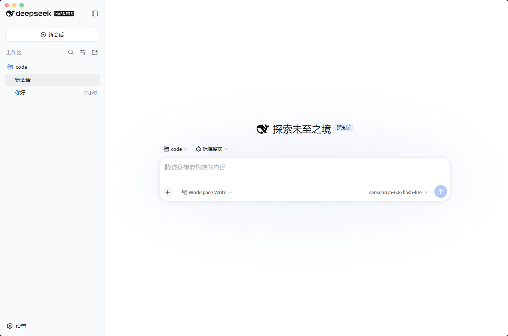

<div align="center">

# dsh desktop

DeepSeek Harness (`dsh web`) 的跨平台 Tauri 桌面客户端

[English](README.en.md) · **简体中文**

<br/>

[](https://github.com/MochiNek0/dsh-desktop/releases)
[](https://tauri.app/)

[](LICENSE)

<br/>
<br/>



</div>

<br/>

> **非官方声明**：本项目为基于 [DeepSeek Harness](https://github.com/deepseek-ai/deepseek-harness) 开发的第三方桌面客户端，与 DeepSeek 官方无隶属或合作关系。

---

## 概述

**dsh desktop** 启动时会自动在后台拉起本地 `dsh web` 服务并内嵌至原生桌面窗口。无需手动打开终端或管理端口，会话记录、凭证与配置均与 CLI 全局共享（存储于 `$DSH_HOME`，默认 `~/.dsh`）。

## 特性

- **开箱即用**：自动检测并配置 Node.js 及 `dsh` 运行环境，无需系统管理员权限。
- **无感共存**：采用动态端口分配，与终端手动运行的 `dsh web` 互不干扰。
- **轻量原生**：现代无边框 UI，支持自动系统主题、中英文双语界面、系统级消息通知及开机自启。
- **环境共享**：与全局终端共用同一 `dsh` 命令，支持启动检查与一键无缝升级。
- **插件管理**：内置可视化插件面板，无需配置终端即可一键安装/卸载插件；同时也提供自带正确环境的终端入口。
- **稳定守护**：单实例进程守护，应用退出时自动回收所有关联子进程；`dsh web` 意外退出时自动返回加载页并提供重启。

## 安装与下载

> **重要提示**：建议用户安装 **v0.1.3 及以后的版本**，之前的版本可能存在一些已知问题。目前应用已在 **Windows** 和 **Linux（Debian系统）** 上完成验证。

前往 [Releases 页面](https://github.com/MochiNek0/dsh-desktop/releases) 下载适用于您操作系统的最新安装包：

| 操作系统 | 安装包格式 | 说明 |
| :--- | :--- | :--- |
| **Windows** | `.exe` 安装包 | 需系统已安装 WebView2（如缺失将自动引导下载） **[已验证]** |
| **macOS** | `.dmg` 镜像 | 通用二进制架构，原生支持 Apple Silicon 及 Intel 设备 **[暂未验证，欢迎反馈]** |
| **Linux** | `.AppImage` / `.deb` | 推荐使用 `.AppImage` 以获得完整的自更新支持 **[Debian系统已验证]** |

> **macOS 首次运行提示**
>
> 若首次打开时遇到安全拦截提示，可在访达中右键点击应用选择「打开」，或在终端中执行以下命令解除隔离：
> ```sh
> xattr -dr com.apple.quarantine /Applications/dsh-desktop.app
> ```

## 插件

应用内置了可视化的插件管理面板，无需命令行即可轻松管理 dsh 插件：

- **可视化管理**：通过 **菜单 → 插件…** 打开面板。支持从预设列表一键安装，或手动输入 npm 包名 / GitHub 仓库地址（如 `github:owner/repo`）安装。
- **原生终端**：如果希望使用 CLI，可通过 **菜单 → 打开终端** 启动一个已自动配置好 `dsh` 环境变量的终端，不污染系统全局 PATH。

> **提示**：安装 `github:` 形式的插件时，pnpm 出于安全考虑默认会拦截构建脚本。如遇报错，请根据面板提示打开插件目录，在 `$DSH_HOME/profiles/web/pnpm-workspace.yaml` 的 `allowBuilds` 字段中手动放行该插件。

## 配置与环境变量

应用支持通过环境变量自定义运行行为：

| 环境变量 | 说明 | 默认值 |
| :--- | :--- | :--- |
| `DSH_BIN` | 指定 `dsh` 可执行文件的绝对路径（优先级最高） | 自动检索系统 PATH |
| `DSH_HOME` | 指定 `dsh` 数据、凭证与配置的存储目录 | `~/.dsh` |

## 开发与构建

### 前置要求

- **Rust**: 稳定版工具链（`stable`）
- **Node.js**: 18.0 或更高版本

### 常用命令

```sh
# 安装依赖
npm install

# 启动开发模式（启用 DevTools）
npm run dev

# 构建正式发布包（输出至 src-tauri/target/release/bundle/）
npm run build
```

## 项目结构

```text
dsh-desktop/
├── dist/index.html               # 前端加载等待与错误提示页面
├── scripts/                      # 依赖初始化与运行时打包脚本
├── src-tauri/
│   ├── Cargo.toml                # Rust 依赖项与构建配置
│   ├── tauri.*.conf.json         # 多平台 Tauri 配置
│   └── src/                      # Rust 后端源码（窗口管理、进程托管、托盘、更新）
└── package.json
```

## 注意事项

- **首次启动联网**：应用首次启动时若未检测到本地环境，需联网拉取 `dsh` 核心组件，请保持网络连通。
- **自动更新**：支持桌面端应用自动检查并安装更新（Linux 环境仅支持 AppImage 格式）。

## 声明

本项目为开源第三方客户端，仅供学习与便利使用。如有任何问题与建议，欢迎提交 [Issue](https://github.com/MochiNek0/dsh-desktop/issues) 或 Pull Request。

## 许可证

本项目基于 [MIT 许可证](LICENSE) 开源。
